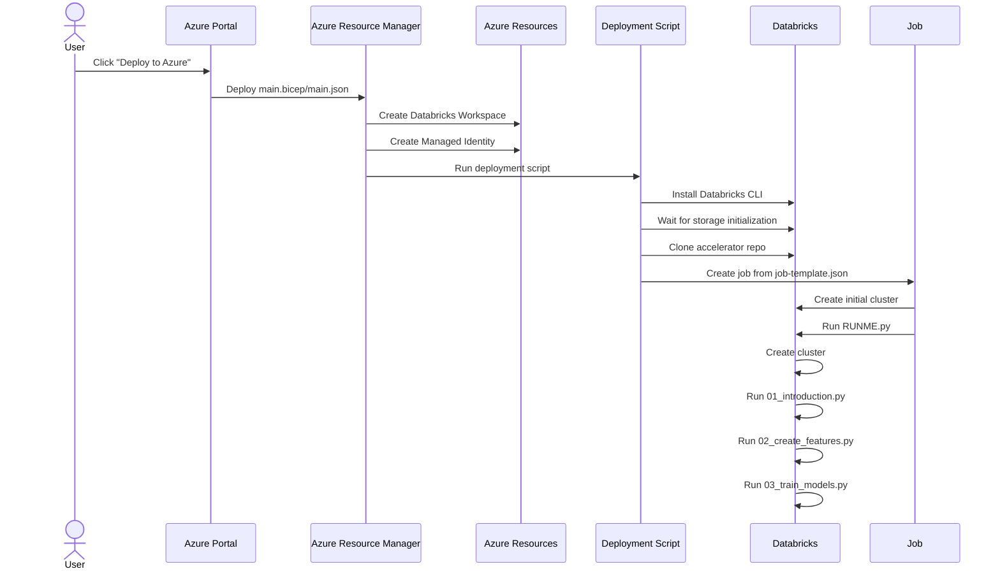

# Azure Deployment with Bicep

This directory contains resources for automating the deployment of the Predicting Implied Volatility accelerator to Azure Databricks using a Bicep template.

## Deployment Architecture

The deployment process follows this workflow:

## Deployment Components

### main.bicep/main.json

The main Bicep template creates the core Azure resources:
1. A managed identity with appropriate permissions
1. An Azure Databricks workspace (or uses an existing one)
1. Triggers the databricks.bicep module to handle Databricks-specific setup

### databricks.bicep

This module handles the Databricks-specific deployment steps:
1. Installs the Databricks CLI
1. **Waits for Azure Databricks storage initialization** - critical for reliable deployment
1. Clones the accelerator repository from GitHub
1. Creates and submits a job to run the RUNME.py notebook

### job-template.json

Defines the configuration for the initial job that:
1. Creates a cluster with appropriate specifications
1. Runs the RUNME.py notebook using this cluster

### RUNME.py

The setup notebook that:
1. Creates a second cluster with the specific runtime (13.3.x-gpu-ml-scala2.12) required for running the main notebooks
1. Executes the main accelerator notebooks (01_introduction.py, 02_create_features.py, 03_train_models.py)